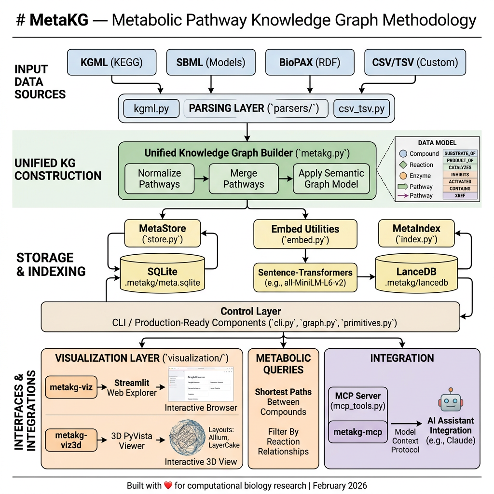

[](https://www.python.org/)
[](https://polyformproject.org/licenses/noncommercial/1.0.0/)
[](https://github.com/flux-frontiers/metabo_kg/releases)
[](https://python-poetry.org/)
[](https://zenodo.org/badge/latestdoi/1184537477)

# MetaboKG — Metabolic Pathway Knowledge Graph

**MetaboKG turns the world's metabolic pathway databases into a single, local, queryable knowledge graph — and then lets you ask it questions in English, simulate flux through it, and hand it to an LLM as structured context.**

It ingests pathways in the formats biology actually publishes in (KGML, SBML, BioPAX, CSV), normalizes them into a unified compound/reaction/enzyme/pathway graph backed by SQLite, and indexes the nodes in LanceDB so that *"glucose metabolism"* and *"hexokinase"* both find the right places to start exploring. From there you can trace shortest paths between metabolites, run flux balance analysis or kinetic ODE simulations, knock out enzymes to see what changes, render the result in 2D or 3D, or expose the whole thing to Claude over MCP.

Everything runs on your laptop. No cloud APIs, no quotas, no data leaving the machine.



---

## Sister projects

MetaboKG is part of a small family of knowledge-graph systems that share the same hybrid semantic-plus-structural design:

- **[PyCodeKG](https://github.com/flux-frontiers/pycode_kg)** — the same idea applied to Python source code. It's what lets MetaboKG understand its own architecture.
- **[DocKG](https://github.com/flux-frontiers/doc_kg)** — the same idea applied to Markdown and prose. It indexes MetaboKG's own documentation, so the docs you're reading now are themselves a queryable graph.

Together they form **KGRAG**, a federated retrieval layer where one query can span code, documentation, and pathway data simultaneously.

---

## What you can actually do with it

The system is organized around five things, each documented in its own file:

| If you want to… | Start here |
|---|---|
| **Install it** | [docs/INSTALL.md](docs/INSTALL.md) — minimal, simulation, viz, viz3d, BioPAX, and `all` extras |
| **Build a graph from your data** | [docs/WORKFLOW.md](docs/WORKFLOW.md) — the full ingest → enrich → index pipeline, stage by stage |
| **Understand what the graph contains** | [docs/FEATURES.md](docs/FEATURES.md) and [docs/HSA_SUMMARY.md](docs/HSA_SUMMARY.md) — coverage tables for each corpus |
| **Use the Python API or CLI** | [docs/EXAMPLES.md](docs/EXAMPLES.md) — worked examples for every public capability |
| **Simulate metabolism** | [docs/CAPABILITIES.md §7](docs/CAPABILITIES.md) — FBA, ODE kinetics, what-if perturbations, with the math |
| **Look up a command** | [docs/CHEATSHEET.md](docs/CHEATSHEET.md) — every CLI flag and every MCP tool in one page |
| **Expose the graph to an LLM** | [docs/MCP.md](docs/MCP.md) — MCP server setup, tool reference, agent workflows |
| **See the full capability map** | [docs/CAPABILITIES.md](docs/CAPABILITIES.md) — the deep reference for everything below |

If you only read one file after this one, read [docs/CAPABILITIES.md](docs/CAPABILITIES.md). It's the canonical tour.

---

## Get started in 60 seconds

All pathway data is bundled in the repo — there's nothing to download to get going.

```bash
git clone https://github.com/flux-frontiers/metabo_kg.git
cd metabo_kg
python3.12 -m venv .venv && source .venv/bin/activate
poetry install --extras all

# One-shot: integrity check, fetch missing TSVs, build hsa + cge + icho, seed kinetics
metabokg-init

# Look around
metabokg-info             # what got built and where
metabokg-viz              # 2D Streamlit explorer at http://localhost:8500
```

That's the recommended path. [docs/INSTALL.md](docs/INSTALL.md) has the variant installs (simulation-only, viz-only, contributor setup); [docs/WORKFLOW.md](docs/WORKFLOW.md) has the manual stage-by-stage equivalent if you want to see what `metabokg-init` is actually doing.

---

## The three bundled corpora

MetaboKG ships with three production-grade metabolic models, each built into its own colocated database. The same CLI, API, and MCP tools work against any of them — and KGRAG can federate queries across all three at once.

| Corpus | What it is | Detail doc |
|---|---|---|
| **`metabokg-hsa`** | 369 KEGG pathways for *Homo sapiens* — the complete human metabolome (17K+ nodes, 40K+ edges) | [docs/HSA_SUMMARY.md](docs/HSA_SUMMARY.md) |
| **`metabokg-cge`** | 366 KEGG pathways for *C. griseus* (Chinese Hamster Ovary) — the workhorse of biopharma | [docs/cho_workflow.md](docs/cho_workflow.md) |
| **`metabokg-icho`** | iCHO2441 genome-scale model (SBML/FBC v2): 6,663 reactions, 4,456 metabolites, 2,441 gene products | [docs/icho_workflow.md](docs/icho_workflow.md) |

Each corpus is a drop-in target:

```bash
metabokg-build --data data/hsa_pathways    # → data/hsa_pathways/.metabokg/hsa.sqlite
metabokg-build --data data/cge_pathways    # → data/cge_pathways/.metabokg/cge.sqlite
metabokg-build --data data/icho_model      # → data/icho_model/.metabokg/icho.sqlite
```

To bring your own data, drop KGML / SBML / BioPAX / CSV files in a directory and point `--data` at it. Format detection is automatic; see [docs/CAPABILITIES.md §2](docs/CAPABILITIES.md) for parser specifics.

---

## How retrieval works

Search is hybrid by design. A query like *"hexokinase"* runs in two phases:

1. **Vector phase** — the query is embedded with a local sentence-transformer (`BAAI/bge-small-en-v1.5` by default, 384-dim, ~130 MB cached after first use) and LanceDB returns the `k` closest compounds, enzymes, and pathways by cosine similarity.
2. **Graph expansion phase** — each seed hit is expanded `hop` BFS steps along the typed edges (`SUBSTRATE_OF`, `PRODUCT_OF`, `CATALYZES`, `CONTAINS`, `INHIBITS`, `ACTIVATES`, `XREF`) so reaction context surfaces alongside the names that matched.

When no LanceDB index exists (`--no-index`, or `--text-only` at query time), both the CLI and the Streamlit app fall back to case-insensitive substring matching. The embedding model is swappable — any `sentence-transformers`-compatible HuggingFace ID or local model directory works as a drop-in replacement; just rebuild the index against the new model.

The graph itself is built around four node kinds (compound, reaction, enzyme, pathway) and seven edge relations. Full schema, edge semantics, and enrichment behaviour live in [docs/CAPABILITIES.md §3–§5](docs/CAPABILITIES.md).

---

## Simulation

With `--extras simulate` installed, the same graph becomes a simulation substrate:

- **FBA** — steady-state flux optimization via `scipy.optimize.linprog` (HiGHS backend)
- **ODE kinetics** — time-course concentration dynamics under Michaelis-Menten rate laws, integrated with `scipy.integrate.solve_ivp` using **BDF** (metabolic systems are stiff; RK45 will hang)
- **What-if perturbations** — enzyme knockouts, partial inhibitions, substrate pulses, with delta flux or delta concentration sorted by magnitude

Kinetic parameters are seeded from BRENDA / SABIO-RK literature values via `metabokg-init` (or `kg.seed_kinetics()` from the API). The math, the rate equations (including the Haldane reversible extension), and the recommended solver settings are in [docs/CAPABILITIES.md §7](docs/CAPABILITIES.md); worked examples are in [docs/EXAMPLES.md §6–§8](docs/EXAMPLES.md).

---

## Use it from Claude (or any LLM)

Two integration paths, depending on the LLM:

- **Claude / MCP-aware clients** — `metabokg-mcp` exposes the graph as MCP tools (`pack`, `query_pathway`, `get_compound`, `get_reaction`, `find_path`, `seed_kinetics`, `simulate_fba`, `simulate_ode`, `simulate_whatif`). Setup for Claude Code, Claude Desktop, Kilo Code, and Copilot is in [docs/MCP.md](docs/MCP.md).
- **Anything else (Ollama, OpenAI, local llamas)** — `metabokg-pack "TCA cycle"` produces self-contained Markdown or JSON with reactions, substrates, products, and enzymes already wired together. Pipe it into any context window:

  ```bash
  metabokg-pack "fatty acid oxidation" | ollama run llama3 "Summarize what's unusual about this pathway"
  ```

---

## Visualization

- **`metabokg-viz`** — Streamlit web explorer (2D, filterable, search-driven)
- **`metabokg-viz3d --layout allium|cake`** — PyVista 3D viewer with two layout modes (hub-and-spoke, or concentric rings by topological distance)

Both read from whatever corpus is active. UI walkthroughs and layout tradeoffs are in [docs/CAPABILITIES.md §6](docs/CAPABILITIES.md).

---

## Architecture

```
metabokg/
├── parsers/         # kgml, sbml, biopax, csv_tsv — format-specific
├── graph.py         # MetabolicGraph: file discovery + dispatch
├── primitives.py    # MetaNode, MetaEdge — core data types
├── store.py         # MetaStore — SQLite persistence + graph queries
├── index.py         # MetaIndex — LanceDB vector indexing
├── embed.py         # embedding utilities
├── orchestrator.py  # MetaKG — the public façade
├── cli.py           # all metabokg-* command entry points
├── mcp_tools.py     # MCP server
└── visualization/   # Streamlit + PyVista (2D/3D)
```

The MCP server and CLI are thin wrappers over the same `MetaKG` orchestrator that the Python API exposes — there's exactly one code path for each capability. Architectural deep-dives (complexity, coupling, hotspots, and the PageRank/centrality of the Python codebase itself) live in [docs/analysis_v0.7.0.md](docs/analysis_v0.7.0.md), [docs/meta_kg_analysis_20260306.md](docs/meta_kg_analysis_20260306.md), and [docs/metakg-codekg-analysis-2026-03-03.md](docs/metakg-codekg-analysis-2026-03-03.md).

---

## Documentation map

| Doc | What it covers |
|---|---|
| [docs/INSTALL.md](docs/INSTALL.md) | All install variants, extras, contributor setup, troubleshooting |
| [docs/WORKFLOW.md](docs/WORKFLOW.md) | The build pipeline, stage by stage; what each `metabokg-*` command does |
| [docs/CAPABILITIES.md](docs/CAPABILITIES.md) | The canonical reference: parsers, store, retrieval, simulation, MCP, CLI |
| [docs/FEATURES.md](docs/FEATURES.md) | Feature inventory and per-corpus coverage tables |
| [docs/EXAMPLES.md](docs/EXAMPLES.md) | Worked examples for every public capability — Python and CLI |
| [docs/MCP.md](docs/MCP.md) | MCP server setup for Claude / Kilo / Copilot, tool reference, agent flows |
| [docs/HSA_SUMMARY.md](docs/HSA_SUMMARY.md) | The human metabolome corpus in detail |
| [docs/cho_workflow.md](docs/cho_workflow.md) | The CHO (`cge`) corpus build and quirks |
| [docs/icho_workflow.md](docs/icho_workflow.md) | The iCHO2441 genome-scale model (SBML/FBC v2) |
| [docs/CHEATSHEET.md](docs/CHEATSHEET.md) | Every command, every flag, every MCP tool — one page |
| [CHANGELOG.md](CHANGELOG.md) | Release history |

---

## Contributing

Fork, branch from `main`, follow [ruff](https://docs.astral.sh/ruff/) + [mypy](https://mypy.readthedocs.io/), use `:param:` docstrings, write tests, open a PR. Code-quality commands and the testing layout are in [docs/INSTALL.md](docs/INSTALL.md) (contributor section) and [docs/CAPABILITIES.md §12](docs/CAPABILITIES.md).

---

## Citation

If you use MetaboKG in your research, please cite it:

[](https://zenodo.org/badge/latestdoi/1184537477)

> Suchanek, E. G. (2026). *MetaboKG: Metabolic Pathway Knowledge Graph* (Version 0.7.0) [Software]. Flux-Frontiers. https://github.com/flux-frontiers/metabo_kg

```bibtex
@software{suchanek_metabo_kg,
  author    = {Suchanek, Eric G.},
  title     = {{MetaboKG}: Metabolic Pathway Knowledge Graph},
  version   = {0.7.0},
  year      = {2026},
  publisher = {Flux-Frontiers},
  url       = {https://github.com/flux-frontiers/metabo_kg},
}
```

Full citation metadata in [`CITATION.cff`](CITATION.cff).

---

## License

**PolyForm Noncommercial License 1.0.0** — free for academic research, education, personal projects, and evaluation. Commercial use requires a separate license; contact the author.

---

## Support & acknowledgments

- **Issues** — [GitHub Issues](https://github.com/flux-frontiers/metabo_kg/issues)
- **Discussions** — [GitHub Discussions](https://github.com/flux-frontiers/metabo_kg/discussions)
- Sister projects [PyCodeKG](https://github.com/flux-frontiers/pycode_kg) and [DocKG](https://github.com/flux-frontiers/doc_kg) for the semantic analysis that made this codebase legible to itself
- Layout algorithms adapted from [repo_vis](https://github.com/Suchanek/repo_vis)
- KEGG, Reactome, MetaCyc, and the iCHO2441 authors (Hefzi et al. 2016) for pathway data
- PyVista, Streamlit, LanceDB, and sentence-transformers for the foundations

---

*Built for computational biology research — egs · Last updated April 2026*
